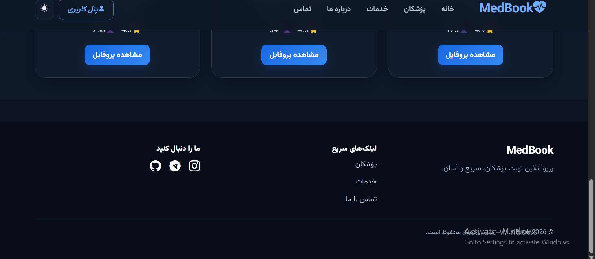
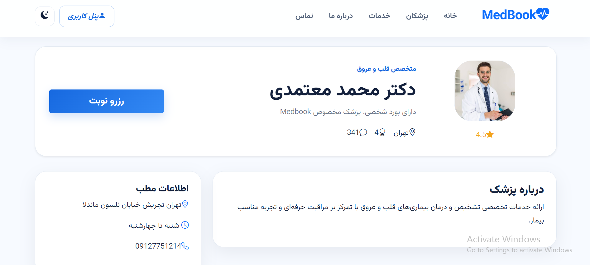
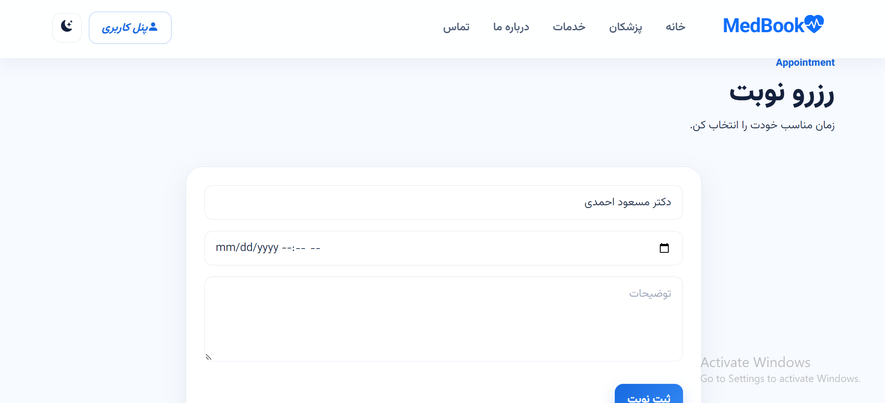
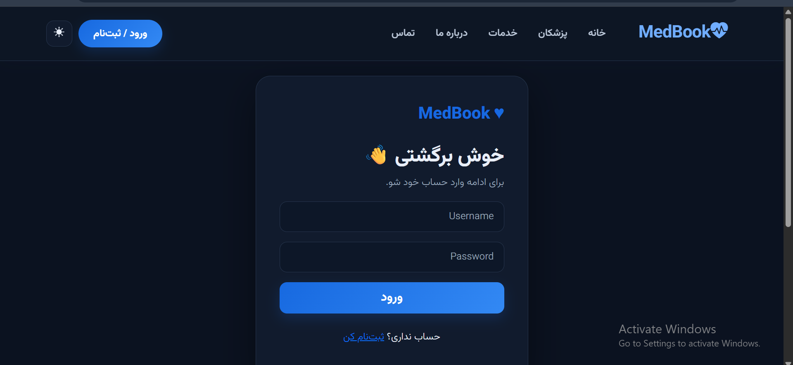
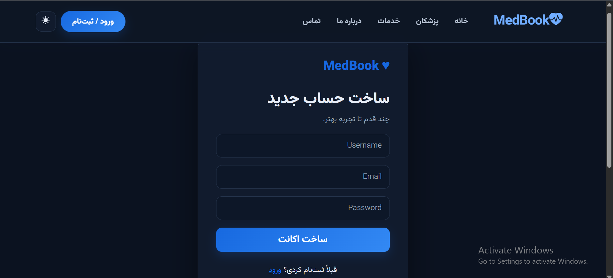
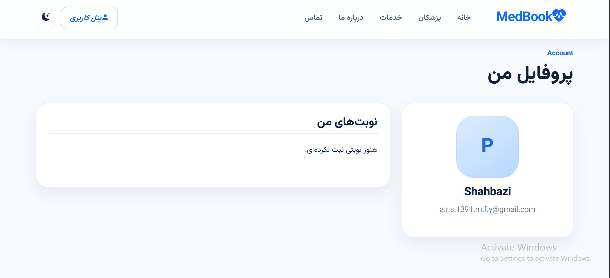
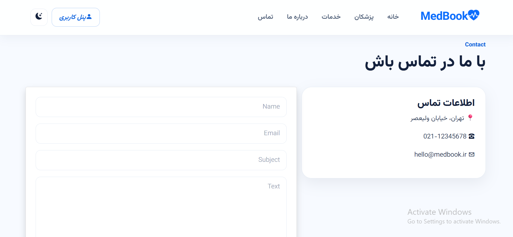
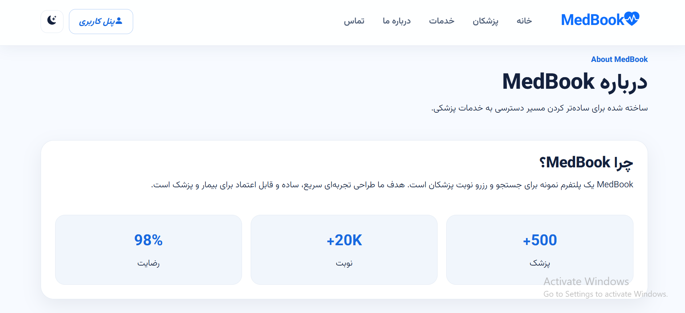

# 🩺 Medbook

<p align="center">
  A Django-based doctor appointment booking platform built as a portfolio project.
</p>

## Web Site Link:
<h1 align="center">
  <a href="https://medbook.com">
    🌐 Live Demo
  </a>
</h1>

<p align="center">
  
  
  
  
  
  
</p>

---

## 📌 About

**Medbook** is a doctor appointment booking website developed with **Python and Django**.

The project focuses on building a complete web application with user authentication, doctor profiles, specialty-based browsing, appointment booking, responsive UI, and database management.

It was created as a practical portfolio project to improve my Django backend and frontend development skills.

---

## ✨ Features

- 🔐 User registration and login
- 👤 User profile
- 👨‍⚕️ Doctor profiles
- 🩺 Doctor specialty filtering
- 📅 Appointment booking
- ⭐ Doctor ratings and information
- 🌙 Dark mode
- 📱 Responsive design
- 📄 Custom 404 page
- 🖼️ Static and media file handling
- 🔒 Environment variables for sensitive settings
- 🛠️ Django Admin panel

---

## 🧰 Tech Stack

| Technology | Usage |
|---|---|
| Python | Backend |
| Django | Web Framework |
| HTML5 | Structure |
| CSS3 | Styling |
| Bootstrap 5 | UI & Responsive Design |
| Bootstrap Icons | Icons |
| SQLite | Database |
| Git | Version Control |
| GitHub | Project Hosting |

---

## 🏗️ Project Structure

```text
MedBook/
│
├── Accounts/
│   ├── views.py
│   ├── urls.py
│   └── ...
│
├── Doctors/
│   ├── models.py
│   ├── views.py
│   ├── urls.py
│   └── ...
│
├── Home/
│   ├── views.py
│   ├── urls.py
│   └── ...
│
├── Config/
│   ├── settings.py
│   ├── urls.py
│   └── ...
│
├── templates/
├── static/
├── media/
├── screenshots/
├── manage.py
├── requirements.txt
├── .gitignore
└── README.md
```

---

## 📦 Django Apps

### `Accounts`

Handles user-related functionality:

- Registration
- Login / Logout
- User profile
- Authentication

### `Doctors`

Handles the main medical functionality:

- Doctor models
- Doctor profiles
- Specialties
- Appointment booking
- Doctor information

### `Home`

Contains the general website pages:

- Home
- About
- Contact
- Services

### `Config`

Contains the main Django project configuration, including:

- Settings
- Main URL configuration
- Project-level configuration

---

# 📸 Project Gallery

> A visual look at the current Medbook interface.

## 🏠 Home Page

<table>
  <tr>
    <td align="center">
      
      <br>
      <strong>Home</strong>
    </td>
  </tr>
</table>

## 🔥 Home Pages and Doctors

<table>
  <tr>
    <td align="center">
      
      <br>
      <strong>Home _ Categories</strong>
    </td>
    <td align="center">
      
      <br>
      <strong>Home — Doctors</strong>
    </td>
    <td align="center">
      
      <br>
      <strong>Home — Footer</strong>
    </td>
  </tr>
  <tr>
    <td align="center">
      
      <br>
      <strong>Doctors _ Search</strong>
    </td>
    <td align="center">
      
      <br>
      <strong>Doctors</strong>
    </td>
    <td align="center">
      
      <br>
      <strong>Doctor Profile</strong>
    </td>
  </tr>
</table>

## 👨‍⚕️ Doctors & Appointments

<table>
  <tr>
    <td align="center">
      
      <br>
      <strong>Appointment</strong>
    </td>
    <td align="center">
      
      <br>
      <strong>Login</strong>
    </td>
    <td align="center">
      
      <br>
      <strong>Register</strong>
    </td>
  </tr>
  <tr>
    <td align="center">
      
      <br>
      <strong>Profile</strong>
    </td>
    <td align="center">
      
      <br>
      <strong>Contact</strong>
    </td>
    <td align="center">
      
      <br>
      <strong>About</strong>
    </td>
  </tr>
</table>

---

## 🚀 Getting Started

### 1. Clone the repository

```bash
git clone https://github.com/AShBackend/Medbook.git
cd Medbook
```

### 2. Create a virtual environment

```bash
python -m venv Venv
```

### 3. Activate the virtual environment

**Windows:**

```bash
Venv\Scripts\activate
```

### 4. Install dependencies

```bash
pip install -r requirements.txt
```

### 5. Configure environment variables

Create a `.env` file in the project root:

```env
SECRET_KEY=your-secret-key
```

### 6. Run migrations

```bash
python manage.py migrate
```

### 7. Start the development server

```bash
python manage.py runserver
```

Then open:

```text
http://127.0.0.1:8000/
```

---

## 🔐 Environment & Security

Sensitive configuration is stored outside the repository using environment variables.

The `.env` file is excluded from Git through `.gitignore`.

Example:

```env
SECRET_KEY=your-secret-key
```

> Never upload your real `SECRET_KEY` or other sensitive credentials to GitHub.

---

## 📊 Project Status

**Current Status: 🟠 Pre-Deployment**

The main website functionality is implemented and the project is available on GitHub.

Current focus:

- Final debugging
- Production configuration
- Deployment
- Portfolio presentation

---

## 🛣️ Roadmap

- [x] Build the main Django website
- [x] User authentication
- [x] Doctor profiles
- [x] Appointment system
- [x] Specialty filtering
- [x] Responsive UI
- [x] GitHub repository
- [ ] Production deployment
- [ ] REST API with Django REST Framework
- [ ] Further UI/UX improvements

---

## 🎯 What I Practiced

Through Medbook, I practiced:

- Django project and app structure
- Django ORM
- Models and relationships
- Authentication
- Forms and validation
- URL routing
- Templates
- Static and media files
- Bootstrap responsive design
- Git and GitHub
- Environment variables
- Basic production preparation

---

## 🤝 Contributing

This project was created primarily as a personal portfolio project.

Suggestions, feedback, and improvements are welcome.

---

## 📄 License

This project is currently a personal portfolio project.

---

## 👨‍💻 Author

**AShBackend**

GitHub:  
https://github.com/AShBackend

---

<p align="center">
  Made with Python & Django ❤️
</p>
